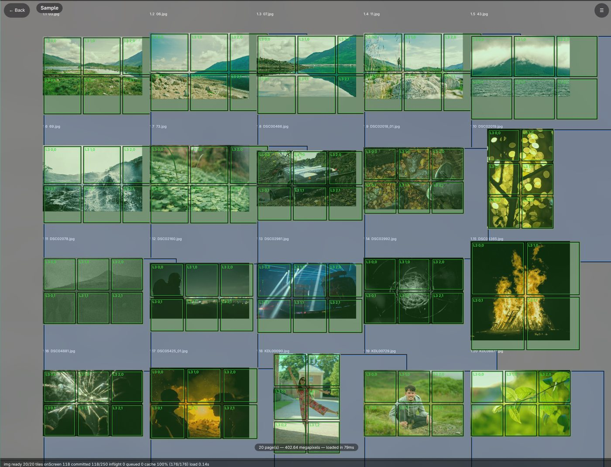
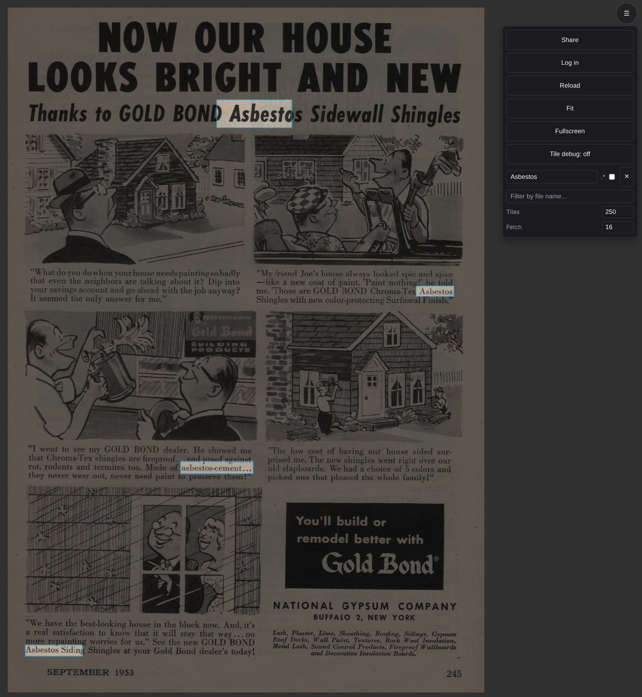

# Book Viewer

A self-hosted archive viewer for scanned books and magazines. It serves pages as an
immutable DeepZoom-style tile pyramid (fast pan/zoom over huge 1200dpi scans), runs on-device
OCR so text is searchable and selectable, and gates everything behind copyright-aware access
rules. The client is a plain ES-module SPA — no build step, no JavaScript frameworks.



## Live demo

There is a public instance with a small sample book you can browse right now.

| Scan to open the sample page | or open it directly |
|---|---|
|  | [archive.kunodlk.com/4Nz0mBT](https://archive.kunodlk.com/4Nz0mBT) |

The site root is [archive.kunodlk.com](https://archive.kunodlk.com).

## Features

- **Smooth pan/zoom over huge scans** — pages are pre-encoded into a tile pyramid
  (disk-cached, GPU-accelerated when available); you can zoom from a full shelf view down to
  the paper grain without ever decoding a full page in the browser.


- **OCR text overlay** — every page's text is recognised in the background
  (RapidOCR/PaddleOCR onnx models) and layered over the scan; hold Ctrl and drag a box to
  select any text and copy it.


- **Full-text search** — search a whole book for a word or a regex and jump straight to every
  match, with the rest of the page dimmed around the hits.



- **Share links** — every book and page gets a short stable URL that renders real link
  previews (Open Graph) for iMessage/Discord/Reddit, and works even for crawlers that never
  run JavaScript.
- **Copyright-aware access** — pages outside their public-domain date are served blurred
  (or not at all, per book); the rules are region-aware (UK/EU vs US) and flip automatically
  when a page becomes public domain. Real tiles are cached privately so blurred content can
  never leak through a shared cache.
- **Admin panel** — a server-rendered CRUD UI for managing books, editors, rights holders,
  per-page copyright rules, and viewer accounts.
- **Works everywhere** — responsive full-bleed UI with floating chrome and gesture
  pan/zoom/pinch; built for desktop, iPad, and iPhone Safari/Chrome.

## Quick start (Docker Compose)

Clone the repo and put scanned books on disk (one folder per book, images as pages):

```bash
git clone https://github.com/KunoDLK/photo-crop.git
cd photo-crop
mkdir -p books cache
```

`docker-compose.yml`:

```yaml
services:
  bookviewer:
    build:
      context: .
      dockerfile: server/Dockerfile
    ports:
      - "8471:8000"
    volumes:
      - ./books:/archive/Library   # scanned books: one folder per book, images as pages
      - ./cache:/archive/cache     # encoded tiles + OCR results (created automatically)
    environment:
      ARCHIVE_ROOT: /archive/Library
      CACHE_DIR: /archive/cache
      CACHE_GB: "8"                # disk budget for encoded tiles
      ARCHIVE_USERNAME: admin      # owner login for the admin panel
      ARCHIVE_PASSWORD: change-me
    # Optional: NVIDIA GPU for OpenCL-accelerated resampling (falls back to CPU)
    # gpus: all
    restart: unless-stopped
```

```bash
docker compose up -d --build
# open http://localhost:8471
```

Pages are sorted by filename: `{group}_{order}-name.jpg` (e.g. `2_001-Page.jpg`); anything
that doesn't match the pattern lands in a trailing "extra" group.

## Run from source

Requires Python 3.11+:

```bash
pip install -r server/requirements.txt
python -m server.main          # or: uvicorn server.main:app
```

Honors `HOST` / `PORT` and every setting below can be set via environment variables or a
`.env` file.

## Configuration

| Variable | Default | What it does |
|---|---|---|
| `ARCHIVE_ROOT` | `/archive/Library` | Root folder of the scanned books |
| `CACHE_DIR` | `/archive/cache` | Encoded tiles, OCR results, rights DB |
| `CACHE_GB` | `8` | Disk budget for the encoded-tile cache |
| `PAGE_CACHE_BYTES` | 6 GiB | RAM budget for decoded page mipmaps |
| `OCR_*` | — | OCR cache dir, max dim, confidence threshold, language |
| `ARCHIVE_USERNAME` / `ARCHIVE_PASSWORD` | `admin` / empty | Owner login (admin panel) |
| `RIGHTS_DB_PATH` | `cache_dir/rights.db` | Rights/access database |
| `SESSION_SECRET` / `SESSION_COOKIE_SECURE` | auto / `true` | Session signing and cookie policy |
| `DEFAULT_REGION` / `DEV_REGION_HEADER` | empty / `false` | Region detection for rights rules |

## How it works

- `server/` is a FastAPI app: tile rendering (disk cache → decoded-page cache → mipmap →
  resample → progressive JPEG), OCR with a background worker queue, path-based share links,
  rights/region policy, admin CRUD, and crawler-facing HTML with Open Graph previews.
- `server/static/` is the client: ES modules with no bundler — a tile scheduler, an
  rAF render loop, OCR overlay + search, and the responsive UI.
- Every content route resolves a per-request access decision (owner → grants → book
  visibility → copyright rule → page default), so the same server safely serves both public
  and restricted material.

## The crop tool

This repo also contains a legacy, fully client-side crop tool for extracting photos from
flatbed scans — see [`crop-tool/`](crop-tool/). It is a single `index.html`, unrelated to
the server.
